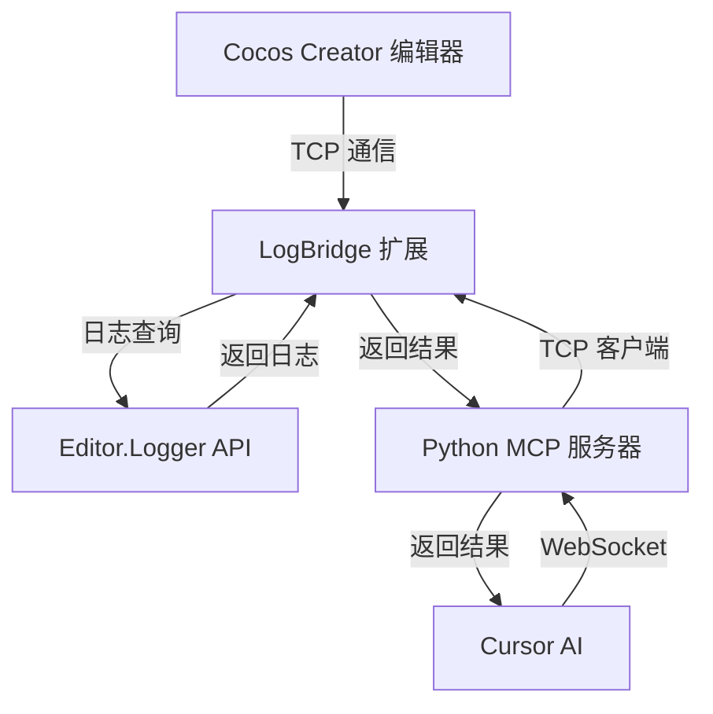

# Cocos MCP 扩展开发指南

本文档面向希望维护、调试或扩展 Cocos MCP 功能的开发者。

## 项目架构

### 整体结构

```
cocos-mcp/
├── Editor/                 # Cocos Creator 编辑器扩展代码
│   ├── @types/             # TypeScript 类型定义
│   ├── LogBridge.ts        # 日志桥接核心实现
│   ├── config/             # 配置文件
│   └── main.ts             # 扩展入口点
├── Python/                 # Python MCP 服务器
│   ├── server.py           # 服务器实现
│   ├── cocos_connection.py # Cocos TCP 客户端
│   ├── log_client.py       # 日志客户端
│   ├── config/             # 配置文件
│   └── tools/              # 工具函数
├── dist/                   # 编译后的 JavaScript 文件
├── node_modules/           # Node.js 依赖
├── package.json            # 项目配置
└── tsconfig.json           # TypeScript 配置
```

### 运行流程



1. Cocos Creator 编辑器启动并加载 cocos-mcp 扩展
2. LogBridge 初始化并启动 TCP 服务器（端口 6400）
3. Python MCP 服务器连接到 TCP 服务器
4. Cursor AI 通过 WebSocket 连接到 Python MCP 服务器
5. 用户发送命令，流经 Cursor AI -> Python -> LogBridge -> Cocos Creator
6. 结果按相反顺序返回

## 开发环境设置

### 编辑器扩展开发

1. **安装 Node.js 依赖**

   ```bash
   cd /path/to/cocos-mcp
   npm install
   ```

2. **编译 TypeScript 代码**

   ```bash
   cd /path/to/cocos-mcp
   tsc
   ```

3. **启用实时编译（可选）**

   ```bash
   cd /path/to/cocos-mcp
   tsc --watch
   ```

### Python 服务器开发

1. **创建虚拟环境（可选但推荐）**

   ```bash
   cd /path/to/cocos-mcp/Python
   uv venv
   source .venv/bin/activate  # 在 Linux/macOS 上
   # 或在 Windows 上：
   # .venv\Scripts\activate
   ```

2. **安装依赖**

   ```bash
   uv pip install -r requirements.txt
   ```

## 核心模块详解

### LogBridge 类 (LogBridge.ts)

LogBridge 是扩展的核心类，负责创建 TCP 服务器并处理命令。

主要方法：
- `getInstance()`: 单例模式获取实例
- `startTcpServer()`: 启动 TCP 服务器
- `setupCommandHandlers()`: 注册命令处理器
- `handleQueryLogs()`: 处理日志查询命令
- `handleClearLogs()`: 处理日志清除命令

示例：如何修改 TCP 端口：

```typescript
// 在 config/Config.ts 中修改
export const Config = {
    TCP_HOST: 'localhost',
    TCP_PORT: 8000  // 修改为新端口
};
```

### Python MCP 服务器 (server.py)

Python MCP 服务器负责连接 Cursor AI 和 Cocos Creator 扩展。

主要组件：
- `MCPServer`: WebSocket 服务器，处理 Cursor AI 请求
- `CocosTCPClient`: TCP 客户端，连接到 LogBridge
- 命令处理器：处理查询日志、清除日志等命令

示例：如何修改 WebSocket 端口：

```python
# 在 config/config.py 中修改
WEBSOCKET_HOST = "localhost"
WEBSOCKET_PORT = 9000  # 修改为新端口
```

## 编码规范

### TypeScript

- 使用 2 空格缩进
- 使用 camelCase 命名变量和函数
- 使用 PascalCase 命名类和接口
- 尽可能添加类型注解
- 添加合适的注释，特别是对于公共 API

示例：

```typescript
/**
 * 处理日志查询命令
 * @param params 查询参数
 * @returns 查询结果
 */
private async handleQueryLogs(params: QueryLogsParams): Promise<QueryLogsResult> {
  try {
    const showLogs = params.show_logs !== false;
    const showWarnings = params.show_warnings !== false;
    const showErrors = params.show_errors !== false;
    const searchTerm = params.search_term || '';

    // 获取日志并过滤
    const logs = await Editor.Logger.query() || [];
    // ... 过滤代码 ...

    return { logs: filteredLogs };
  } catch (error: any) {
    console.error('Error querying logs:', error);
    throw error;
  }
}
```

### Python

- 遵循 PEP 8 规范
- 使用 4 空格缩进
- 使用蛇形命名法（snake_case）命名变量和函数
- 使用类型注解（Python 3.7+）

示例：

```python
async def handle_query_logs(self, params: Dict[str, Any]) -> Dict[str, Any]:
    """
    处理日志查询请求
    
    Args:
        params: 查询参数 
        
    Returns:
        查询结果
    """
    try:
        # 发送查询到 Cocos TCP 服务器
        response = await self.cocos_client.send_command("QUERY_LOGS", params)
        return response.get("result", {"logs": []})
    except Exception as e:
        logging.error(f"Error querying logs: {e}")
        return {"error": str(e)}
```

## 调试技巧

### 调试编辑器扩展

1. **启用 Cocos Creator 开发者工具**
   
   在 Cocos Creator 中，按下 `F12` 或选择 `开发者 -> 开发者工具` 打开 Chrome DevTools。

2. **检查日志输出**
   
   在 DevTools 的 Console 面板中查看日志输出。你也可以添加 `console.debug()` 语句来追踪代码执行。

   ```typescript
   // 添加调试日志
   console.debug('LogBridge: Received command:', commandType, params);
   ```

3. **重新加载扩展**
   
   修改代码后，在 `扩展管理器` 中重新加载扩展，或重启 Cocos Creator。

### 调试 Python 服务器

1. **启用详细日志**
   
   在 `server.py` 中增加日志输出级别：
   
   ```python
   import logging
   logging.basicConfig(level=logging.DEBUG)
   ```

2. **手动测试 TCP 连接**
   
   使用 `telnet` 或其他 TCP 客户端工具测试连接：
   
   ```bash
   telnet localhost 6400
   ```
   
   然后输入：
   ```
   {"type":"ping","params":{}}
   ```
   
   应该收到：
   ```
   {"status":"success","result":{"message":"pong"}}
   ```

3. **添加断点调试**

   使用 VSCode 或 PyCharm 添加断点，调试 Python 代码：

   ```python
   # 在 VSCode 中，你可以在代码中添加以下行来触发断点
   import debugpy; debugpy.breakpoint()
   ```

## 扩展功能

### 添加新的命令类型

要添加新的命令类型，需要同时修改 TypeScript 和 Python 代码。

#### 1. 在 LogBridge.ts 中添加新的命令处理函数：

```typescript
/**
 * 处理获取场景信息的命令
 */
private async handleGetSceneInfo(params: any): Promise<any> {
  try {
    // 使用 Editor API 获取场景信息
    const sceneInfo = {
      activeSceneName: Editor.Scene?.currentScene?.name || '',
      nodeCount: Editor.Scene?.currentScene?.children.length || 0,
      // 其他场景信息...
    };
    
    return sceneInfo;
  } catch (error: any) {
    console.error('Error getting scene info:', error);
    throw error;
  }
}
```

#### 2. 在 setupCommandHandlers 方法中注册命令：

```typescript
private setupCommandHandlers() {
  // 现有命令
  this.commandHandlers.set('QUERY_LOGS', this.handleQueryLogs.bind(this));
  this.commandHandlers.set('CLEAR_LOGS', this.handleClearLogs.bind(this));
  
  // 添加新命令
  this.commandHandlers.set('GET_SCENE_INFO', this.handleGetSceneInfo.bind(this));
}
```

#### 3. 在 Python 服务器中添加相应处理器：

```python
async def handle_get_scene_info(self, params):
    """处理获取场景信息的命令"""
    try:
        response = await self.cocos_client.send_command("GET_SCENE_INFO", params)
        return response.get("result", {})
    except Exception as e:
        logging.error(f"Error getting scene info: {e}")
        return {"error": str(e)}
```

#### 4. 更新 Python MCP 服务器命令映射：

```python
def setup_command_handlers(self):
    """设置命令处理器映射"""
    self.command_handlers = {
        "query_logs": self.handle_query_logs,
        "clear_logs": self.handle_clear_logs,
        "connection_status": self.handle_connection_status,
        "get_scene_info": self.handle_get_scene_info,  # 新命令
    }
```

### 改进日志查询

可以通过添加以下功能来改进日志查询：

#### 1. 添加分页功能：

```typescript
private async handleQueryLogs(params: any): Promise<any> {
  // 添加分页参数
  const page = params.page || 1;
  const pageSize = params.page_size || 50;
  
  // 获取日志后进行分页
  const allLogs = await Editor.Logger.query() || [];
  const startIdx = (page - 1) * pageSize;
  const endIdx = startIdx + pageSize;
  
  // 分页过滤
  const pagedLogs = allLogs.slice(startIdx, endIdx);
  
  return {
    logs: pagedLogs,
    total: allLogs.length,
    page: page,
    pageSize: pageSize,
    totalPages: Math.ceil(allLogs.length / pageSize)
  };
}
```

#### 2. 添加时间范围过滤：

```typescript
// 添加按时间范围过滤
const startTime = params.start_time || 0;
const endTime = params.end_time || Date.now();

const timeFilteredLogs = filteredLogs.filter((log: LogEntry) => {
  return log.time >= startTime && log.time <= endTime;
});
```

#### 3. 添加高级搜索选项：

```typescript
// 添加高级搜索选项
const advancedSearch = params.advanced_search || {};
const moduleFilter = advancedSearch.module;
const severityFilter = advancedSearch.min_severity; // 例如: 'log', 'warn', 'error'

let advancedFilteredLogs = filteredLogs;

if (moduleFilter) {
  advancedFilteredLogs = advancedFilteredLogs.filter((log: LogEntry) => {
    return log.message.includes(`[${moduleFilter}]`);
  });
}

if (severityFilter) {
  const severityLevels = {
    'log': 0,
    'warn': 1,
    'error': 2
  };
  const minLevel = severityLevels[severityFilter] || 0;
  
  advancedFilteredLogs = advancedFilteredLogs.filter((log: LogEntry) => {
    const logLevel = severityLevels[log.type.toLowerCase()] || 0;
    return logLevel >= minLevel;
  });
}
```

## 性能优化

### 缓存日志结果

为了减少对 Editor.Logger.query() 的频繁调用，可以实现日志缓存：

```typescript
private logCache: LogEntry[] = [];
private lastQueryTime: number = 0;
private readonly CACHE_TTL = 2000; // 缓存有效期（毫秒）

private async getCachedLogs(): Promise<LogEntry[]> {
  const now = Date.now();
  
  // 如果缓存有效，直接返回缓存
  if (this.logCache.length > 0 && now - this.lastQueryTime < this.CACHE_TTL) {
    return this.logCache;
  }
  
  // 缓存过期，重新查询
  this.logCache = await Editor.Logger.query() || [];
  this.lastQueryTime = now;
  
  return this.logCache;
}

private async handleQueryLogs(params: any): Promise<any> {
  try {
    // 使用缓存方法获取日志
    const logs = await this.getCachedLogs();
    
    // 其余过滤逻辑保持不变...
  } catch (error: any) {
    console.error('Error querying logs:', error);
    throw error;
  }
}
```

### 优化 TCP 通信

减少 TCP 通信的开销：

```typescript
// 批量处理命令
private pendingCommands: Map<string, { resolve: Function, reject: Function }> = new Map();
private readonly BATCH_TIMEOUT = 50; // 毫秒

public async sendCommand(type: string, params: any): Promise<any> {
  return new Promise((resolve, reject) => {
    const commandId = generateUniqueId();
    this.pendingCommands.set(commandId, { resolve, reject });
    
    // 添加到批处理队列
    if (!this.batchTimeout) {
      this.batchTimeout = setTimeout(() => this.processBatch(), this.BATCH_TIMEOUT);
    }
    
    this.commandBatch.push({ id: commandId, type, params });
  });
}

private async processBatch() {
  const batch = this.commandBatch;
  this.commandBatch = [];
  this.batchTimeout = null;
  
  // 发送批处理请求
  try {
    const response = await this.cocosTCPClient.sendBatch(batch);
    
    // 处理响应
    for (const result of response.results) {
      const handler = this.pendingCommands.get(result.id);
      if (handler) {
        if (result.error) {
          handler.reject(new Error(result.error));
        } else {
          handler.resolve(result.data);
        }
        this.pendingCommands.delete(result.id);
      }
    }
  } catch (error) {
    // 出错时拒绝所有挂起的命令
    for (const [id, handler] of this.pendingCommands.entries()) {
      handler.reject(error);
      this.pendingCommands.delete(id);
    }
  }
}
```

## 发布新版本

1. **更新版本号**
   
   在 `package.json` 中更新版本号：
   
   ```json
   {
     "version": "1.0.1"
   }
   ```

2. **编译代码**
   
   ```bash
   tsc
   ```

3. **测试功能**
   
   在 Cocos Creator 中加载扩展，确保所有功能正常工作。

4. **更新文档**
   
   更新 README.md、USAGE.md 和其他文档，反映新功能或更改。

5. **创建 tag（可选）**
   
   ```bash
   git tag v1.0.1
   git push origin v1.0.1
   ```

6. **发布到 npm（可选）**

   ```bash
   npm publish
   ```

## 与 Cocos Creator API 交互

本扩展使用 Cocos Creator 编辑器的官方 API 与编辑器交互。主要使用的 API 包括：

### 日志 API

```typescript
// 查询日志
const logs = await Editor.Logger.query();

// 清除日志
await Editor.Logger.clear();
```

### 消息 API

```typescript
// 监听日志消息
Editor.Message.addBroadcastListener('console:log', (log) => {
  // 处理日志
});

// 发送命令到场景
await Editor.Message.request('scene', 'query-node', uuid);
```

### 场景 API

```typescript
// 获取当前场景
const currentScene = Editor.Scene.currentScene;

// 查询节点
const node = await Editor.Message.request('scene', 'query-node', uuid);
```

更多 API 请参考 [Cocos Creator 官方文档](https://docs.cocos.com/creator/3.8/manual/zh/editor/extension/api/)。

## 常见问题

### 类型定义问题

如果遇到类型定义问题，检查 `@types/editor.d.ts` 文件是否包含所需 API 的类型定义。可能需要添加更多类型定义：

```typescript
// 在 @types/editor.d.ts 中添加
declare global {
  const Editor: {
    // 现有类型
    Logger: { ... },
    Message: { ... },
    
    // 新增类型
    Scene: {
      callSceneScript(name: string, method: string, ...args: any[]): Promise<any>;
      currentScene: {
        name: string;
        children: any[];
      }
    }
  };
}
```

### 通信问题

如果 TCP 通信出现问题：

1. 确保端口没有被占用
2. 检查防火墙设置
3. 尝试使用不同的端口（需要同时修改编辑器扩展和 Python 服务器）

### 兼容性问题

不同版本的 Cocos Creator 可能有 API 差异。如果你的扩展需要支持多个版本的 Cocos Creator，请考虑使用条件逻辑：

```typescript
// 检查 Creator 版本
const version = Editor.App.version;
if (version.startsWith('3.8.')) {
  // 适用于 3.8.x 的代码
} else if (version.startsWith('3.7.')) {
  // 适用于 3.7.x 的代码
} else {
  console.warn(`Unsupported Cocos Creator version: ${version}`);
}
```

## 高级功能开发示例

### 添加场景节点查询功能

扩展功能，允许查询场景中的节点：

```typescript
/**
 * 处理查询场景节点的命令
 */
private async handleQuerySceneNodes(params: any): Promise<any> {
  try {
    const uuid = params.uuid; // 节点UUID，如果为空则查询根节点
    
    let result: any;
    if (uuid) {
      // 查询特定节点
      result = await Editor.Message.request('scene', 'query-node', uuid);
    } else {
      // 查询根节点及其子节点
      const sceneUuid = await Editor.Message.request('scene', 'query-current-scene');
      result = await Editor.Message.request('scene', 'query-node', sceneUuid);
    }
    
    // 转换为更友好的格式
    return {
      node: {
        uuid: result.uuid,
        name: result.name,
        children: result.children.map(child => ({
          uuid: child.uuid,
          name: child.name
        })),
        components: result.components.map(comp => ({
          uuid: comp.uuid,
          name: comp.__type__
        }))
      }
    };
  } catch (error: any) {
    console.error('Error querying scene nodes:', error);
    throw error;
  }
}
```

### 添加资源管理功能

扩展功能，允许查询项目资源：

```typescript
/**
 * 处理查询项目资源的命令
 */
private async handleQueryAssets(params: any): Promise<any> {
  try {
    const type = params.type; // 资源类型，如 'texture', 'audio', 'prefab' 等
    const path = params.path; // 资源路径，为空则查询所有
    
    // 查询资源
    const assets = await Editor.Message.request('asset-db', 'query-assets', {
      type: type,
      pattern: path ? `${path}/**/*` : '**/*'
    });
    
    return {
      assets: assets.map(asset => ({
        uuid: asset.uuid,
        name: asset.name,
        path: asset.path,
        type: asset.type
      }))
    };
  } catch (error: any) {
    console.error('Error querying assets:', error);
    throw error;
  }
}
```

## 未来计划

未来版本计划添加的功能：

1. **资源管理功能**：查询、导入和管理项目资源
2. **场景操作功能**：创建、修改和删除场景节点
3. **项目构建功能**：启动项目构建并获取构建结果
4. **脚本编辑功能**：创建和编辑脚本文件
5. **组件检查器**：查询和修改组件属性

## 贡献指南

欢迎贡献代码、报告问题或提出新功能建议！

1. Fork 仓库
2. 创建功能分支 (`git checkout -b feature/amazing-feature`)
3. 提交修改 (`git commit -m 'Add amazing feature'`)
4. 推送分支 (`git push origin feature/amazing-feature`)
5. 创建 Pull Request

请确保你的代码遵循项目的编码规范，并添加适当的测试和文档。 